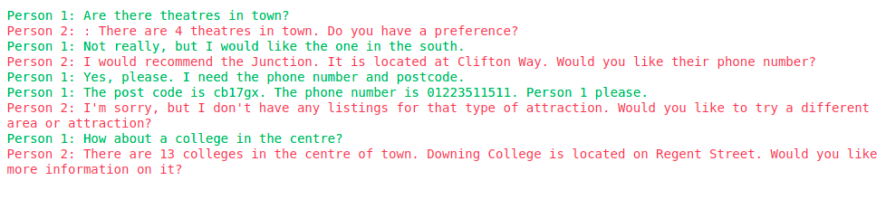
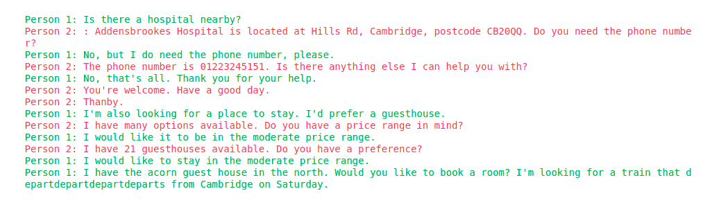
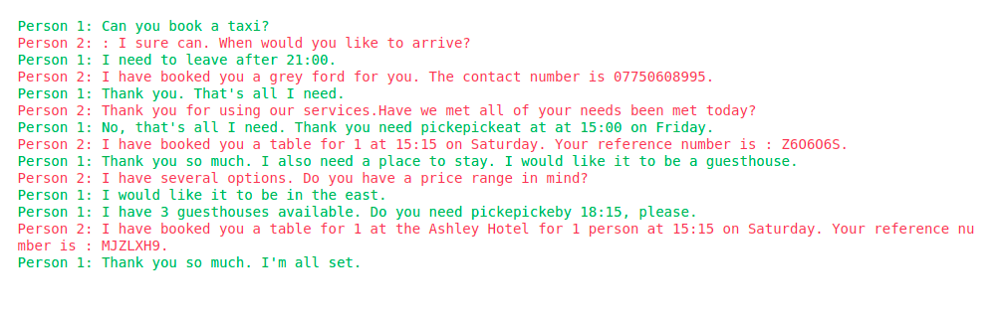

# Chatbot Project

## __Introduction:__  

   In the Project, we are about to use efficient Transformer(Reformer) to generate a dialogue between two bots using **Trax**.
   > The dataset that we have used is called **MultiWoz** dataset. The dataset that we have used has more than 10,000 human annotated dialogues and spans multiple domains and topics. Some dialogues include multiple domains and others include single domains. 

   <!-- > Dataset can be downloaded from the given [Link](https://metatext.io/datasets/conll-2003-++). -->

## __Project Description__

Root directory of this project contains:
>
> - **2 sub-folders**

> - **several [.py] files**

> - **1 text files containing all the 
requirements of this project**

> - **1 readme.md file containing all the necessary instructions.**

> - **Some test image examples**

Details about the folders and files:
 >
 > - **data(folder):**  Contains all the vocabulary and dataset files that will be used in this project. 

 > - **model(folder):** Contains out **train,  and validation** checkpoints, model configuration file and our trained model will be saved here.

 > - **config.py:** Configuration file for our project data paths and variables.

 > - **utils.py** : Contains different helper functions.

 > - **process.py** : python script to process and generate our train and validation data streams.

 > - **model.py** : Contains python scripts to define our model and model helper functions.

 > - **train.py**: Training script to train the model.

 > - **inference.py**: Here we can test our model by giving a starting sentence and maximum len of our conversation which will generate the conversation by applying the model. 

### __Instructions:__

> Before starting we need to satisfy all the dependencies. For that reason need to execute the following command. (All the commands need to be executed from the root folder)
>
> - __Install the dependencies:__  
    `pip install -r requirements.txt`  

> Before start the training we need to process our dataset into the correct format. and then we will start our training. 
>
> - __To process and start training the dataset:__  
    `python train.py`  

> - __To evaluate the trained model:__  
>   
>> - Our inference script takes **two** argument parser parameters to infer from the trained model.

>> - **parameter 1(--s_sen)**: Our staring sentence starts with a **space** followed by (**person 1:**) delimeter and end with (**person 2:**)  delimeter.

>> - **parameter 2(--max_len)**: Maximum length of our generated conversation.

 
>
> - __Running inference script:__  
> `!python inference.py --s_sen ' Person 1: starting/line/of/the/convo Person 2: ' --max_len 200`
>

## Inference

> Some generated conversation with the trained model:

